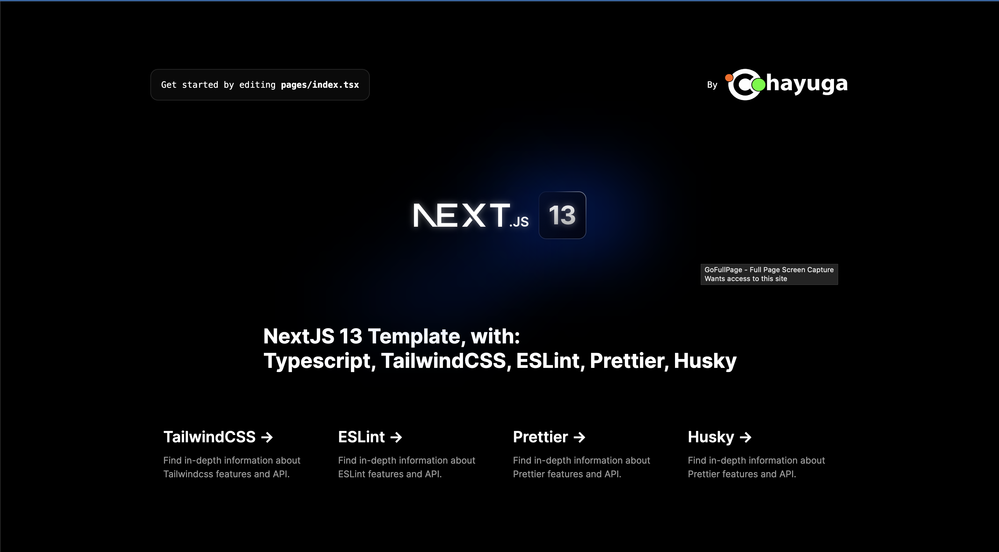

1. YouTube: [How To Setup Next.JS with TypeScript, Prettier, ESLint and Husky](https://youtu.be/sH93pQb9bWM)

2. [Setting Up Next.js Project With ESLint, Typescript, and AirBnB Configuration](https://www.lukinotes.com/2022/01/setting-up-nextjs-project-with-eslint-typescript-airbnb.html)
